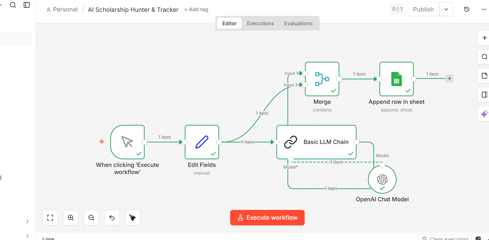
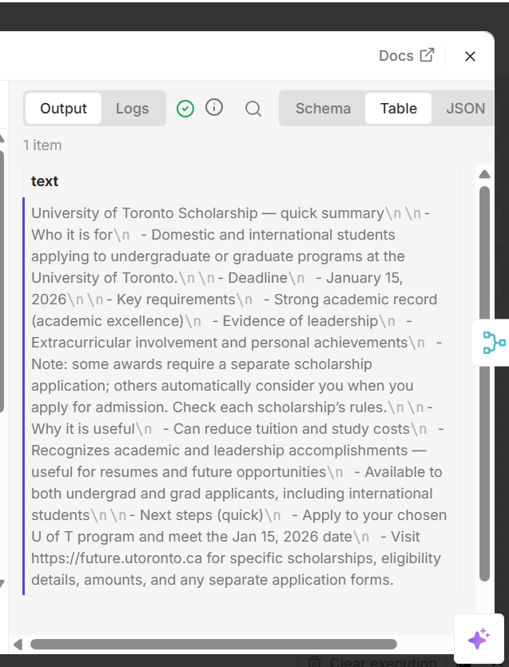
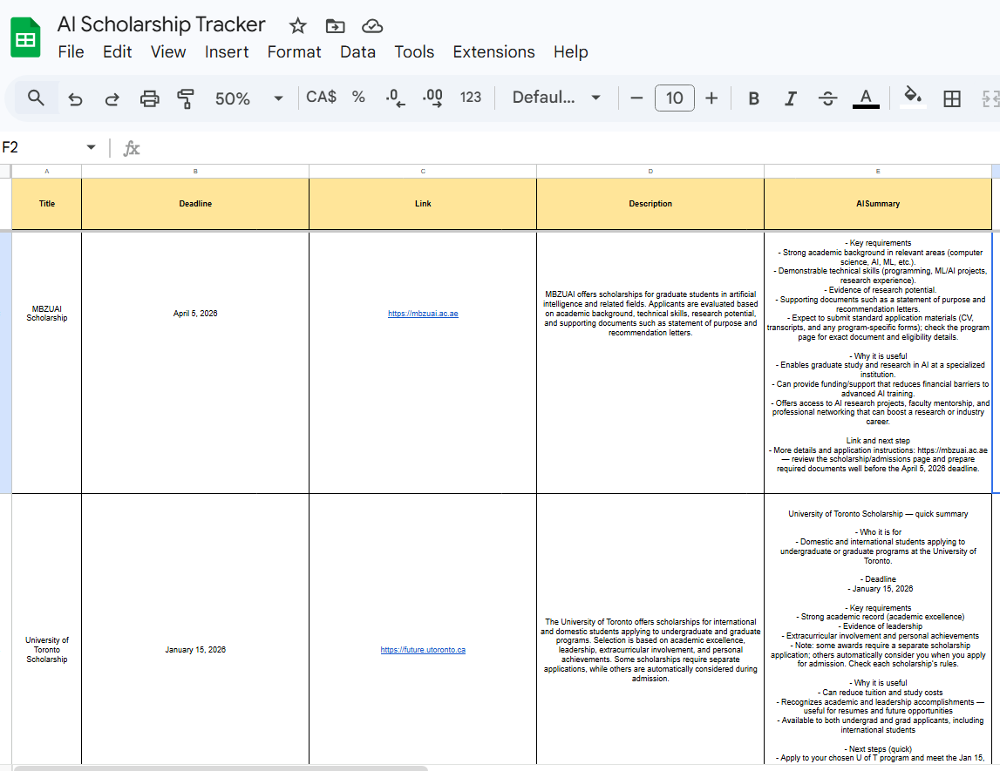

# AI Scholarship Hunter & Tracker (n8n)

**Author:** Haneen Altaie  
**Program:** AI Integration and Governance, Humber College  

This project is an AI-powered automation workflow built in n8n to help students organize and track scholarship opportunities more efficiently.

---

## Project Objective

The goal of this workflow is to automate the process of collecting scholarship information, summarize it using AI, and store it in a structured tracker.

---

## Problem Statement

Students often find scholarship information scattered across different websites and presented in long, unclear descriptions. This makes it difficult to quickly compare opportunities and stay organized.

This workflow solves that by turning scholarship information into a structured, AI-assisted tracking system.

---

## Workflow Overview

The workflow performs the following steps:

1. Manually triggers the workflow
2. Takes scholarship information as input
3. Uses an AI model to summarize the scholarship
4. Merges the original data with the AI-generated summary
5. Saves the results into Google Sheets

---

## Tools and Technologies

- n8n
- OpenAI
- Google Sheets
- Workflow Automation
- AI Summarization

---

## Workflow Structure

```text
Manual Trigger → Edit Fields → Basic LLM Chain → Merge → Google Sheets
                                ↑
                     OpenAI Chat Model
```

---

## Input Fields

The workflow processes the following scholarship data:

- Title
- Deadline
- Link
- Description

---

## Output

The workflow stores the following in Google Sheets:

- Title
- Deadline
- Link
- Description
- AI Summary

---

## Example Use Case

This workflow can help students automatically organize scholarship opportunities and understand them more quickly using AI-generated summaries.

Example tested scholarship inputs:
- MBZUAI Scholarship
- University of Toronto Scholarship

---

## Files

- `workflow.json` → exported n8n workflow
- `workflow-overview.png` → full workflow screenshot
- `ai-output.png` → example AI summary output
- `tracker-sheet.png` → Google Sheets tracker output

---

## Screenshots

### Workflow Overview


### AI Output Example


### Google Sheets Tracker


---

## Key Learning Outcomes

Through this project, I practiced:

- workflow automation
- AI integration in n8n
- data structuring and merging
- Google Sheets automation
- practical use of low-code AI workflows

---

## Conclusion

This project demonstrates how AI and automation can be combined to create a practical student support tool.

It shows a simple but useful end-to-end workflow for scholarship tracking and AI-assisted information organization.
